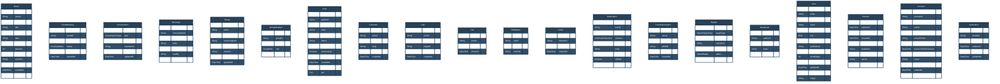

# Data Flow (Screen ↔ Data Source)

```mermaid
%%{init:{'theme':'base','themeVariables':{'background':'#060810','primaryColor':'#2a4055','primaryTextColor':'#f8fafc','primaryBorderColor':'#1e4060','lineColor':'#f59e0b','secondaryColor':'#0f172a','tertiaryColor':'#1a0a20','attributeBackgroundColorEven':'#ffffff','attributeBackgroundColorOdd':'#f1f5f9','textColor':'#1e293b','nodeBorder':'#1e4060','clusterBkg':'#0a0e1a','fontFamily':'JetBrains Mono','fontSize':'14'}}}%%
erDiagram
%% table:Event path:prisma/schema.prisma
%% table:EventBooking path:prisma/schema.prisma
%% table:Conversation path:prisma/schema.prisma
%% table:Message path:prisma/schema.prisma
%% table:Group path:prisma/schema.prisma
%% table:GroupMember path:prisma/schema.prisma
%% table:Post path:prisma/schema.prisma
%% table:Comment path:prisma/schema.prisma
%% table:Like path:prisma/schema.prisma
%% table:Poll path:prisma/schema.prisma
%% table:PollOption path:prisma/schema.prisma
%% table:Follow path:prisma/schema.prisma
%% table:Notification path:prisma/schema.prisma
%% table:PushSubscription path:prisma/schema.prisma
%% table:Report path:prisma/schema.prisma
%% table:Broadcast path:prisma/schema.prisma
%% table:User path:prisma/schema.prisma
%% table:Session path:prisma/schema.prisma
%% table:Account path:prisma/schema.prisma
%% table:Verification path:prisma/schema.prisma
  Event {
    String id PK
    String userId
    EventType type
    String title
    String passage
    String date
    String time
    Int duration
    Int capacity
    String zoomUrl
    String notes
    DateTime createdAt
    DateTime updatedAt
  }
  EventBooking {
    String id PK
    String eventId
    String userId
    BookingStatus status
    Boolean reminderSent
    DateTime createdAt
  }
  Conversation {
    String id PK
    ConversationType type
    String groupId
    String memberIds
    DateTime createdAt
    DateTime updatedAt
  }
  Message {
    String id PK
    String conversationId
    String senderId
    String body
    String attachmentUrl
    String readBy
    DateTime createdAt
  }
  Group {
    String id PK
    String name
    String description
    String coverImageUrl
    Boolean isPrivate
    String ownerId
    DateTime createdAt
    DateTime updatedAt
  }
  GroupMember {
    String id PK
    String groupId
    String userId
    GroupRole role
    DateTime joinedAt
  }
  Post {
    String id PK
    String authorId
    PostType type
    String body
    String mediaUrls
    String linkUrl
    String versePassage
    Boolean isAnswered
    Boolean isHidden
    DateTime createdAt
    DateTime updatedAt
    Poll poll
  }
  Comment {
    String id PK
    String postId
    String authorId
    String body
    Boolean isHidden
    DateTime createdAt
  }
  Like {
    String id PK
    String postId
    LikeTargetType targetType
    String targetId
    String userId
    DateTime createdAt
  }
  Poll {
    String id PK
    String postId
    String question
    DateTime closesAt
  }
  PollOption {
    String id PK
    String pollId
    String label
    String voterIds
  }
  Follow {
    String id PK
    String followerId
    String followingId
    DateTime createdAt
  }
  Notification {
    String id PK
    String userId
    NotificationType type
    NotificationChannel channel
    String title
    String body
    String link
    Boolean isRead
    DateTime createdAt
  }
  PushSubscription {
    String id PK
    String userId
    String endpoint
    String p256dh
    String auth
    DateTime createdAt
  }
  Report {
    String id PK
    ReportTargetType targetType
    String targetId
    String reporterId
    String reason
    ReportStatus status
    DateTime createdAt
  }
  Broadcast {
    String id PK
    String authorId
    String title
    String body
    DateTime createdAt
  }
  User {
    String id PK
    String email
    String passwordHash
    String name
    String initials
    Role role
    Boolean banned
    String banReason
    DateTime banExpires
    Int streakDays
    DateTime createdAt
    DateTime updatedAt
    Boolean emailVerified
    String image
  }
  Session {
    String id PK
    DateTime expiresAt
    String token
    DateTime createdAt
    DateTime updatedAt
    String ipAddress
    String userAgent
    String userId
    String impersonatedBy
  }
  Account {
    String id PK
    String accountId
    String providerId
    String userId
    String accessToken
    String refreshToken
    String idToken
    DateTime accessTokenExpiresAt
    DateTime refreshTokenExpiresAt
    String scope
    String password
    DateTime createdAt
    DateTime updatedAt
  }
  Verification {
    String id PK
    String identifier
    String value
    DateTime expiresAt
    DateTime createdAt
    DateTime updatedAt
  }
```
