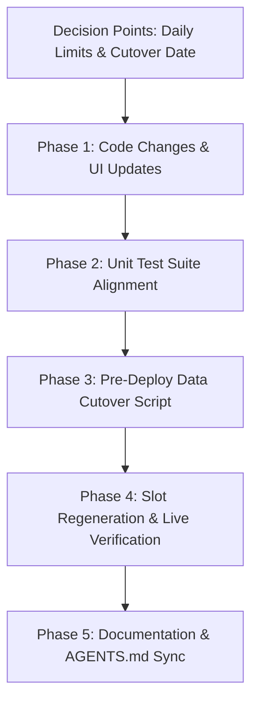

# Hourly Slots Migration — Implementation Plan & Prompt

> **Mandatory Reference Directive**:
> Always consult `@AGENTS.md` and `@bookings.md` before touching any file in this feature.
> `@bookings.md` is the current authoritative spec for the `Slot`, `MeetingLink`, and `BookingConfig` models — it originally specified the **30-minute** grid.
> This document (`slots.md`) supersedes every "30-minute" / "48 slots" statement in `@bookings.md` and `@AGENTS.md` (specifically §11.2). Once this migration ships, update those two files per §9 below so future agents don't reintroduce 30-minute logic.

---

## 0. Goal & Architectural Overview

Change the devotional slot grid from **48 × 30-minute slots/day** to **24 × 60-minute slots/day**, per type (`BIBLE`, `PRAYER`, `PRAISE_WORSHIP`), while:
- Keeping the existing `Slot` schema shape (no new database fields required).
- Preserving slot history that has already passed (for stats and audit integrity).
- Not silently corrupting bookings that already exist on the current 30-minute grid for future dates.

This is fundamentally a **generation-granularity change**, not a schema overhaul:
- `Slot.startTime` and `Slot.endTime` remain plain `HH:MM` strings (e.g. `"08:00"` to `"09:00"`, `"23:00"` to `"24:00"`).
- Total bookable slots per day across all 3 activity types decrease from **144** (48 × 3) to **72** (24 × 3).



---

## 1. Key Metrics Before & After

| Dimension | Previous (30-Min Grid) | New (Hourly Grid) |
|---|---|---|
| **Slot Duration** | 30 minutes | 60 minutes (1 hour) |
| **Slots per Type per Day** | 48 slots (`00:00–00:30` ... `23:30–24:00`) | 24 slots (`00:00–01:00` ... `23:00–24:00`) |
| **Total Daily Slots (3 Types)** | 144 slots (48 × 3) | 72 slots (24 × 3) |
| **Daily Booking Limit Ceiling** | `max(48)` slots/day/type | `max(24)` slots/day/type |
| **Default Daily Limit Setting** | `2` slots (= 1 hour/day) | `1` slot (= 1 hour/day, recommended) |
| **Stats Computation** | `monthSessions * 30` minutes | `monthSessions * 60` minutes |
| **Multi-Slot Selection** | Consecutive 30m increments (`30m, 60m, 90m`) | Consecutive 1h increments (`1h, 2h, 3h`) |

---

## 2. Decision Points — Confirm Before Writing Code

Two critical areas encode "30 minutes" as a *quantity of slots per day*, not literally as minutes. An AI executing this plan must not guess silently:

### 2.1 Daily Booking Limits (`BookingConfig.maxBibleSlotsPerDay`, etc.)
In the 30-minute system, the stored default is `2` (meaning: 2 × 30 min = **1 hour/day** per type).
Once a slot becomes an hour, leaving the numeric default at `2` silently **doubles** everyone's daily time budget (2 × 60 min = 2 hours/day).

- **Recommended Default (used in this plan)**: Halve the defaults to `1`, preserving the existing 1-hour/day time budget.
  - Update `prisma/schema.prisma` `@default(1)` on `BookingConfig`.
  - Update UI fallback initializers in `AdminBookingConfig.tsx` from `?? 2` to `?? 1`.
  - Migrate existing database `BookingConfig` documents via the migration script (§6).
- *Alternative*: If the project owner intentionally wishes to allow members 2 hours/day by default, leave the stored values and defaults at `2` and only change the Zod/UI ceiling to `24`.

### 2.2 Existing Future-Dated Slots on the 30-Minute Grid
`ensureSlotsForDate` pre-generates rolling slots for the current month through the end of next month.
At deploy time, the database contains future 30-minute `Slot` rows, some of which may already be booked.
- **Strict Rule**: Do NOT attempt an automated "merge two half-hour slots into one hour". A member may have booked only 30 minutes, or two different members may hold each half-hour.
- **Cutover Strategy (§6)**: Establish a `CUTOVER` date (e.g. tomorrow or next Monday). Past slots (`date < CUTOVER`) are untouched for history/audit. For `date >= CUTOVER`, check for confirmed bookings; if none, delete unbooked slots and regenerate hourly slots.

---

## 3. Scope & File Touchpoints

### 3.1 Files Touched
| File | Changes Required |
|---|---|
| `lib/services/slotService.ts` | Change generation loop: 48 iterations (30m) $\rightarrow$ 24 iterations (60m). |
| `lib/services/slotStats.ts` | Change `SLOT_MINUTES` constant from `30` to `60`; update docstring. |
| `lib/schemas/slotSchema.ts` | Update `updateBookingConfigSchema`: `max(48)` $\rightarrow$ `max(24)` on limit fields. |
| `components/booking/SlotBookingSheet.tsx` | Change duration calculation: `selectedSlots.length * 30` $\rightarrow$ `* 60`. |
| `components/booking/AdminBookingConfig.tsx` | Update 3 inputs: `max={48}` $\rightarrow$ `max={24}`; fallbacks `?? 2` $\rightarrow$ `?? 1`. |
| `app/terms/page.tsx` | Update copy: "30-minute commitments" $\rightarrow$ "1-hour commitments". |
| `prisma/schema.prisma` | Change `@default(2)` $\rightarrow$ `@default(1)` on `BookingConfig` limit fields. |
| `lib/services/slotStats.test.ts` | Update test assertion: 3 sessions $\times$ 60 min = 180 min (was 90 min). |
| `lib/services/slotService.test.ts` | Update test fixture slot intervals to hourly; add generation test. |
| `lib/services/slotEventEnrichment.test.ts` | Update test fixture slot intervals to hourly. |
| `scripts/migrate-slots-to-hourly.ts` | **[NEW]** Safe cutover migration script for database maintenance. |
| `bookings.md` & `AGENTS.md` | Synchronize documentation to reflect hourly slots. |

### 3.2 Grain-Agnostic Files (DO NOT MODIFY)
The following components and services already operate purely on dynamic `startTime`/`endTime` string comparisons (`HH:MM`) or date boundaries. **Do not modify them**:
- `components/booking/SlotGrid.tsx`
- `components/booking/SlotTimeline.tsx`
- `components/booking/SlotCell.tsx`
- `components/booking/SlotBookingStrip.tsx`
- `components/booking/OverviewLiveGrid.tsx`
- `components/booking/AdminSlotOverride.tsx`
- `components/booking/AdminMeetingLinkManager.tsx`
- `components/booking/AgendaView.tsx`
- `components/booking/ScheduleView.tsx`
- `components/booking/slotTime.ts`
- `lib/services/eventBlockService.ts`
- `lib/services/slotEventEnrichment.ts`
- `actions/slotActions.ts`
- `app/api/v1/slots/route.ts`
- `app/api/v1/slots/generate/route.ts`

---

## 4. Step-by-Step Code Changes & Exact Diffs

### Step 4.1: Schema Validation
**File**: `lib/schemas/slotSchema.ts`

Change daily limit ceiling from `48` to `24`:

```diff
--- a/lib/schemas/slotSchema.ts
+++ b/lib/schemas/slotSchema.ts
@@ -30,9 +30,9 @@ export const adminCancelSlotSchema = z.object({
 // Admin: update booking config
 export const updateBookingConfigSchema = z.object({
-  maxBibleSlotsPerDay: z.number().int().min(0).max(48).optional(),
-  maxPrayerSlotsPerDay: z.number().int().min(0).max(48).optional(),
-  maxWorshipSlotsPerDay: z.number().int().min(0).max(48).optional(),
+  maxBibleSlotsPerDay: z.number().int().min(0).max(24).optional(),
+  maxPrayerSlotsPerDay: z.number().int().min(0).max(24).optional(),
+  maxWorshipSlotsPerDay: z.number().int().min(0).max(24).optional(),
   visibilityMode: z.number().int().min(1).max(4).optional(),
   liveGridUpcoming: z.number().int().min(0).max(10).optional(),
 });
```

---

### Step 4.2: Core Slot Generation Service
**File**: `lib/services/slotService.ts`

Replace 48-iteration 30-minute loop with 24-iteration 60-minute loop:

```diff
--- a/lib/services/slotService.ts
+++ b/lib/services/slotService.ts
@@ -14,3 +14,3 @@
 /**
- * Generate 48 slots per day for a given date range.
+ * Generate 24 slots per day for a given date range (1 hour each).
  */
@@ -29,14 +29,10 @@ export async function generateSlotsForDateRange(startDateStr: string, endDateStr
     for (const type of [EventType.BIBLE, EventType.PRAYER, EventType.PRAISE_WORSHIP]) {
-      for (let i = 0; i < 48; i++) {
-        const startTotalMinutes = i * 30;
-        const startHours = Math.floor(startTotalMinutes / 60).toString().padStart(2, '0');
-        const startMins = (startTotalMinutes % 60).toString().padStart(2, '0');
-        
-        const endTotalMinutes = (i + 1) * 30;
-        const endHours = Math.floor(endTotalMinutes / 60).toString().padStart(2, '0');
-        const endMins = (endTotalMinutes % 60).toString().padStart(2, '0');
+      for (let hour = 0; hour < 24; hour++) {
+        const startHours = hour.toString().padStart(2, '0');
+        const endHours = (hour + 1).toString().padStart(2, '0');
 
         newSlots.push({
           type,
           date: dateStr,
-          startTime: `${startHours}:${startMins}`,
-          endTime: endHours === "24" ? "24:00" : `${endHours}:${endMins}`,
+          startTime: `${startHours}:00`,
+          endTime: endHours === "24" ? "24:00" : `${endHours}:00`,
         });
       }
     }
```

---

### Step 4.3: Stats Service & Historical Caveat
**File**: `lib/services/slotStats.ts`

Change `SLOT_MINUTES` constant to `60`:

```diff
--- a/lib/services/slotStats.ts
+++ b/lib/services/slotStats.ts
@@ -16,3 +16,3 @@ export interface SlotStats {
 }
 
-const SLOT_MINUTES = 30;
+const SLOT_MINUTES = 60;
 
 /** Human duration for slot-derived minutes: 90 → "1h 30m". */
@@ -30,3 +30,3 @@ export function formatMinutes(totalMinutes: number): string {
  * calendar week (Monday-start) sessions, calendar-month sessions,
- * derived monthly time at 30 minutes per session, and per-type counts.
+ * derived monthly time at 60 minutes per session, and per-type counts.
  */
```

> [!NOTE]
> **Historical Stats Caveat**: `monthMinutes` is computed as `monthSessions * SLOT_MINUTES`. Once this constant flips to `60`, any 30-minute slot booked earlier in the current calendar month will be calculated at 60 minutes in that month's aggregated total. This is purely a cosmetic monthly stat calculation (no data corruption) and levels out on the next calendar month.

---

### Step 4.4: Slot Booking Sheet
**File**: `components/booking/SlotBookingSheet.tsx`

Update duration calculation:

```diff
--- a/components/booking/SlotBookingSheet.tsx
+++ b/components/booking/SlotBookingSheet.tsx
@@ -71,3 +71,3 @@ export function SlotBookingSheet({
   const firstSlot = selectedSlots[0];
-  const durationMins = selectedSlots.length * 30;
+  const durationMins = selectedSlots.length * 60;
   const accent = slotAccent[firstSlot.type];
```

---

### Step 4.5: Admin Booking Config
**File**: `components/booking/AdminBookingConfig.tsx`

Update `max={24}` and default fallback initializers `?? 1`:

```diff
--- a/components/booking/AdminBookingConfig.tsx
+++ b/components/booking/AdminBookingConfig.tsx
@@ -43,3 +43,3 @@ export function AdminBookingConfig({ initialConfig, initialLinks }: AdminBooking
   const [config, setConfig] = useState({
-    maxBibleSlotsPerDay: initialConfig?.maxBibleSlotsPerDay ?? 2,
-    maxPrayerSlotsPerDay: initialConfig?.maxPrayerSlotsPerDay ?? 2,
-    maxWorshipSlotsPerDay: initialConfig?.maxWorshipSlotsPerDay ?? 2,
+    maxBibleSlotsPerDay: initialConfig?.maxBibleSlotsPerDay ?? 1,
+    maxPrayerSlotsPerDay: initialConfig?.maxPrayerSlotsPerDay ?? 1,
+    maxWorshipSlotsPerDay: initialConfig?.maxWorshipSlotsPerDay ?? 1,
     visibilityMode: initialConfig?.visibilityMode ?? 4,
@@ -98,4 +98,4 @@ export function AdminBookingConfig({ initialConfig, initialLinks }: AdminBooking
                 type="number"
-                value={config.maxBibleSlotsPerDay ?? 2}
+                value={config.maxBibleSlotsPerDay ?? 1}
                 onChange={(e) =>
                   setConfig({
@@ -106,3 +106,3 @@ export function AdminBookingConfig({ initialConfig, initialLinks }: AdminBooking
                 min={0}
-                max={48}
+                max={24}
               />
@@ -114,4 +114,4 @@ export function AdminBookingConfig({ initialConfig, initialLinks }: AdminBooking
                 type="number"
-                value={config.maxPrayerSlotsPerDay ?? 2}
+                value={config.maxPrayerSlotsPerDay ?? 1}
                 onChange={(e) =>
                   setConfig({
@@ -122,3 +122,3 @@ export function AdminBookingConfig({ initialConfig, initialLinks }: AdminBooking
                 min={0}
-                max={48}
+                max={24}
               />
@@ -130,4 +130,4 @@ export function AdminBookingConfig({ initialConfig, initialLinks }: AdminBooking
                 type="number"
-                value={config.maxWorshipSlotsPerDay ?? 2}
+                value={config.maxWorshipSlotsPerDay ?? 1}
                 onChange={(e) =>
                   setConfig({
@@ -138,3 +138,3 @@ export function AdminBookingConfig({ initialConfig, initialLinks }: AdminBooking
                 min={0}
-                max={48}
+                max={24}
               />
```

---

### Step 4.6: Terms Page Copy
**File**: `app/terms/page.tsx`

Update terms copy on line 178:

```diff
--- a/app/terms/page.tsx
+++ b/app/terms/page.tsx
@@ -177,3 +177,3 @@ export default function TermsPage() {
               <CardContent className="space-y-3 pt-6 text-sm leading-relaxed text-muted-foreground">
-                <p>Devotion slots (Bible, Prayer, Worship) are 30-minute commitments. One booking per slot per member; use consecutive slots if you desire a longer watch. Daily limits per type are set by the community (see Booking page).</p>
+                <p>Devotion slots (Bible, Prayer, Worship) are 1-hour commitments. One booking per slot per member; use consecutive slots if you desire a longer watch. Daily limits per type are set by the community (see Booking page).</p>
                 <ul className="list-disc space-y-1 pl-5">
```

---

### Step 4.7: Prisma Schema Defaults
**File**: `prisma/schema.prisma`

Update `BookingConfig` model defaults:

```diff
--- a/prisma/schema.prisma
+++ b/prisma/schema.prisma
@@ -344,5 +344,5 @@ model MeetingLink {
 model BookingConfig {
   id                    String    @id @default(auto()) @map("_id") @db.ObjectId
-  maxBibleSlotsPerDay   Int       @default(2)
-  maxPrayerSlotsPerDay  Int       @default(2)
-  maxWorshipSlotsPerDay Int       @default(2)
+  maxBibleSlotsPerDay   Int       @default(1)
+  maxPrayerSlotsPerDay  Int       @default(1)
+  maxWorshipSlotsPerDay Int       @default(1)
   visibilityMode        Int       @default(4)  // 1=Full Public, 2=Count Only, 3=Full Transparency, 4=Role-Scoped
```

---

## 5. Test Suite Updates

### Step 5.1: Slot Stats Tests
**File**: `lib/services/slotStats.test.ts`

```diff
--- a/lib/services/slotStats.test.ts
+++ b/lib/services/slotStats.test.ts
@@ -40,6 +40,6 @@ describe("computeSlotStats", () => {
 
-	it("derives monthly time at 30 minutes per session", () => {
+	it("derives monthly time at 60 minutes per session", () => {
 		const stats = computeSlotStats([{ date: day(0) }, { date: day(1) }, { date: day(2) }], TODAY)
 		expect(stats.monthSessions).toBe(3)
-		expect(stats.monthMinutes).toBe(90)
+		expect(stats.monthMinutes).toBe(180)
 	})
```

### Step 5.2: Slot Service Tests
**File**: `lib/services/slotService.test.ts`

Update slot test fixtures to hourly windows and add a test verifying 24 hourly slots generation:

```diff
--- a/lib/services/slotService.test.ts
+++ b/lib/services/slotService.test.ts
@@ -8,3 +8,3 @@ describe("getActiveHostsForTime", () => {
   it("returns null hosts when no slot is active", () => {
     const slots: ActiveSlotLike[] = [
-      { type: "BIBLE", startTime: "08:00", endTime: "08:30", bookedBy: "u1" },
+      { type: "BIBLE", startTime: "08:00", endTime: "09:00", bookedBy: "u1" },
     ]
     expect(getActiveHostsForTime(slots, "10:00")).toEqual({
@@ -19,5 +19,5 @@ describe("getActiveHostsForTime", () => {
   it("returns the booked user for the active slot of each type", () => {
     const slots: ActiveSlotLike[] = [
-      { type: "BIBLE", startTime: "08:00", endTime: "08:30", bookedBy: "u1" },
-      { type: "PRAYER", startTime: "08:30", endTime: "09:00", bookedBy: "u2" },
+      { type: "BIBLE", startTime: "07:00", endTime: "08:00", bookedBy: "u1" },
+      { type: "PRAYER", startTime: "08:00", endTime: "09:00", bookedBy: "u2" },
       {
         type: "PRAISE_WORSHIP",
         startTime: "09:00",
-        endTime: "09:30",
+        endTime: "10:00",
         bookedBy: "u3",
       },
     ]
@@ -37,3 +37,3 @@ describe("getActiveHostsForTime", () => {
   it("is inclusive of start time and exclusive of end time", () => {
     const slots: ActiveSlotLike[] = [
-      { type: "BIBLE", startTime: "08:00", endTime: "08:30", bookedBy: "u1" },
+      { type: "BIBLE", startTime: "08:00", endTime: "09:00", bookedBy: "u1" },
     ]
     expect(getActiveHostsForTime(slots, "08:00").BIBLE).toBe("u1")
-    expect(getActiveHostsForTime(slots, "08:30").BIBLE).toBeNull()
+    expect(getActiveHostsForTime(slots, "09:00").BIBLE).toBeNull()
   })
 
   it("ignores unbooked slots", () => {
     const slots: ActiveSlotLike[] = [
-      { type: "BIBLE", startTime: "08:00", endTime: "08:30", bookedBy: null },
+      { type: "BIBLE", startTime: "08:00", endTime: "09:00", bookedBy: null },
     ]
     expect(getActiveHostsForTime(slots, "08:15")).toEqual({
@@ -56,4 +56,4 @@ describe("getActiveHostsForTime", () => {
   it("picks a single active host per type when multiple consecutive slots are booked", () => {
     const slots: ActiveSlotLike[] = [
-      { type: "BIBLE", startTime: "08:00", endTime: "08:30", bookedBy: "u1" },
-      { type: "BIBLE", startTime: "08:30", endTime: "09:00", bookedBy: "u2" },
+      { type: "BIBLE", startTime: "08:00", endTime: "09:00", bookedBy: "u1" },
+      { type: "BIBLE", startTime: "09:00", endTime: "10:00", bookedBy: "u2" },
     ]
-    // At 08:45 only the second slot is active
-    expect(getActiveHostsForTime(slots, "08:45").BIBLE).toBe("u2")
+    // At 09:15 only the second slot is active
+    expect(getActiveHostsForTime(slots, "09:15").BIBLE).toBe("u2")
   })
```

### Step 5.3: Slot Event Enrichment Tests
**File**: `lib/services/slotEventEnrichment.test.ts`

```diff
--- a/lib/services/slotEventEnrichment.test.ts
+++ b/lib/services/slotEventEnrichment.test.ts
@@ -72,3 +72,3 @@ describe("collectDisplacedBookings", () => {
 		return enrichSlotsWithEvents(
-			[{ ...slot({ id, eventId, previousBookerId }), type: "PRAYER", date: "2026-08-21", startTime: "09:00", endTime: "09:30" }],
+			[{ ...slot({ id, eventId, previousBookerId }), type: "PRAYER", date: "2026-08-21", startTime: "09:00", endTime: "10:00" }],
 			events,
 		)[0]
 	}
@@ -89,3 +89,3 @@ describe("collectDisplacedBookings", () => {
 		expect(displaced[0].startTime).toBe("09:00")
-		expect(displaced[0].endTime).toBe("09:30")
+		expect(displaced[0].endTime).toBe("10:00")
 		expect(displaced[0].type).toBe("PRAYER")
```

---

## 6. Database Migration & Cutover Script

Create `scripts/migrate-slots-to-hourly.ts` for safe database migration:

```typescript
import { prisma } from "../lib/db/prisma";
import { generateSlotsForDateRange } from "../lib/services/slotService";
import { format, startOfMonth, endOfMonth, addMonths } from "date-fns";

/**
 * Migration Script: Cutover to 1-Hour Devotional Slots
 * Usage: bun run scripts/migrate-slots-to-hourly.ts <YYYY-MM-DD>
 */
async function main() {
  const CUTOVER = process.argv[2];

  if (!CUTOVER || !/^\d{4}-\d{2}-\d{2}$/.test(CUTOVER)) {
    console.error("❌ Error: Valid CUTOVER date argument required (YYYY-MM-DD).");
    console.error("Usage: bun run scripts/migrate-slots-to-hourly.ts YYYY-MM-DD");
    process.exit(1);
  }

  console.log(`=== Devotional Slots Migration: Cutover at ${CUTOVER} ===`);

  // 1. Guardrail: Detect any existing confirmed bookings on or after CUTOVER
  const futureBooked = await prisma.slot.findMany({
    where: {
      date: { gte: CUTOVER },
      bookedBy: { not: null },
    },
    select: {
      id: true,
      type: true,
      date: true,
      startTime: true,
      endTime: true,
      bookedBy: true,
    },
  });

  if (futureBooked.length > 0) {
    console.error(`🚨 Halting: Found ${futureBooked.length} confirmed future booking(s) on or after ${CUTOVER}:`);
    console.table(futureBooked);
    console.error("Resolve these with the users/owner or choose a later CUTOVER date before proceeding.");
    process.exit(1);
  }

  // 2. Delete unbooked slots from CUTOVER date onward
  const deleted = await prisma.slot.deleteMany({
    where: {
      date: { gte: CUTOVER },
      bookedBy: null,
    },
  });
  console.log(`✓ Deleted ${deleted.count} unbooked 30-minute slots from ${CUTOVER} onward.`);
  console.log(`✓ Past slots (< ${CUTOVER}) preserved intact for audit & history.`);

  // 3. Update existing BookingConfig singleton defaults if present
  const configUpdated = await prisma.bookingConfig.updateMany({
    data: {
      maxBibleSlotsPerDay: 1,
      maxPrayerSlotsPerDay: 1,
      maxWorshipSlotsPerDay: 1,
    },
  });
  if (configUpdated.count > 0) {
    console.log(`✓ Updated BookingConfig defaults to 1 slot/day (1 hr budget).`);
  }

  // 4. Pre-generate hourly slots from CUTOVER through the end of next month
  const today = new Date();
  const endDate = format(endOfMonth(addMonths(today, 1)), "yyyy-MM-dd");
  console.log(`Generating hourly slots from ${CUTOVER} to ${endDate}...`);
  const created = await generateSlotsForDateRange(CUTOVER, endDate);
  console.log(`✓ Successfully generated ${created} hourly slots.`);

  console.log("=== Migration Completed Successfully ===");
}

main()
  .catch((e) => {
    console.error("Migration failed:", e);
    process.exit(1);
  })
  .finally(async () => {
    await prisma.$disconnect();
  });
```

---

## 7. Order of Operations & Deployment Sequence

1. **Code Review & Pull Request**:
   - Merge code changes (§4) and test changes (§5).
   - The application logic remains backward-compatible with any existing 30-min slots until regeneration.
2. **Pre-Deploy Cutover Execution**:
   - Run the migration script on the environment with the agreed date:
     ```bash
     bun run scripts/migrate-slots-to-hourly.ts 2026-09-15
     ```
3. **Deploy & Warm Slots**:
   - Deploy code to production.
   - Any page requests for dates $\ge$ `CUTOVER` will automatically serve 24 hourly slots per type.
   - Slots can also be warmed on demand by triggering `POST /api/v1/slots/generate`.
4. **Post-Deploy Sanity Checks**:
   - Open `/booking`, `/bible`, `/prayer`, and `/worship`.
   - Confirm 24 one-hour cards or timeline rows are displayed for each date.

---

## 8. Verification & QA Protocol

### 8.1 Automated Tests
Run the entire slot and booking test suite:
```bash
bun test lib/services/slotService.test.ts
bun test lib/services/slotStats.test.ts
bun test lib/services/eventBlockService.test.ts
bun test lib/services/slotEventEnrichment.test.ts
```
*Requirement*: 0 failures.

### 8.2 TypeScript Type-Check
```bash
bunx tsc --noEmit
```
*Requirement*: 0 type errors.

### 8.3 Manual Functional QA
1. **Single Booking**: Book a 1-hour slot (e.g. `08:00 – 09:00`). Verify `SlotBookingSheet` states `1 hr` (60m). Verify confirmation notification.
2. **Consecutive Booking**: Select two contiguous 1-hour slots (`08:00 – 09:00` and `09:00 – 10:00`). Verify sheet displays `2 hrs` (120m).
3. **Overlap Enforcement**: Book `08:00 – 09:00` on Bible. Attempt to book `08:00 – 09:00` on Prayer. Confirm cross-type overlap error is thrown.
4. **Special Event Blocking**: Create a 90-minute Special Event covering `08:30 – 10:00`. Verify that both the `08:00 – 09:00` and `09:00 – 10:00` hourly slots are blocked.
5. **Admin Configuration**: Navigate to `/admin`. Verify inputs for Bible, Prayer, and Worship slot limits cap at `24` and reflect default `1`.

---

## 9. Documentation Sync Checklist

After code changes and migration are confirmed:
- [ ] **`bookings.md`**:
  - Update §"Core Concept": Change `48 fixed 30-minute slots` $\rightarrow$ `24 fixed 60-minute slots`, and `144 bookable slots per day` $\rightarrow$ `72 bookable slots per day`.
  - Update §2.1: `single 30-min window` $\rightarrow$ `single 1-hour window`.
  - Update §2.3: `multiple consecutive 30-min slots` $\rightarrow$ `multiple consecutive 1-hour slots`.
  - Update Section 5: `Daily Timeline (48 slots)` $\rightarrow$ `Daily Timeline (24 slots)`.
- [ ] **`AGENTS.md`**:
  - Line 1096: Update `48 slots × 3 types = 144 slots/day` $\rightarrow$ `24 slots × 3 types = 72 slots/day`.
  - Line 1099: Update `renders the 48 slots` $\rightarrow$ `renders the 24 slots`.
- [ ] Grep repo for obsolete strings:
  ```bash
  grep -rn "30-min" .
  grep -rn "48 slots" .
  ```

---

## 10. Explicit Non-Goals (Scope Protection)

- **Do NOT alter `MeetingLink`**: Meeting links remain 1 per type per day (`BIBLE`, `PRAYER`, `PRAISE_WORSHIP`) and are independent of slot granularity.
- **Do NOT redesign UI components**: `SlotGrid`, `SlotTimeline`, and `SlotCell` are already grain-agnostic.
- **Do NOT alter `Event` or `EventBooking` models**: Only the `Slot` generation grid changes.
- **Do NOT auto-merge historical 30-min slots**: Past slots remain preserved for audit logs and historical stats.

---

## 11. Checklist for the Implementing AI

- [x] Check decision point on daily limit defaults (defaulting to 1).
- [x] Apply diff to `lib/schemas/slotSchema.ts`
- [x] Apply diff to `lib/services/slotService.ts`
- [x] Apply diff to `lib/services/slotStats.ts`
- [x] Apply diff to `components/booking/SlotBookingSheet.tsx`
- [x] Apply diff to `components/booking/AdminBookingConfig.tsx`
- [x] Apply diff to `app/terms/page.tsx`
- [x] Apply diff to `prisma/schema.prisma`
- [x] Update `lib/services/slotStats.test.ts`
- [x] Update `lib/services/slotService.test.ts`
- [x] Update `lib/services/slotEventEnrichment.test.ts`
- [x] Create `scripts/migrate-slots-to-hourly.ts`
- [x] Run `bun test` and ensure all suites pass
- [x] Run `bunx tsc --noEmit` and ensure no type errors
- [x] Synchronize `bookings.md` and `AGENTS.md`
